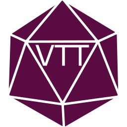

  

# fvtt-player-client
A small utility created to help your Foundry players quickly and easily connect to your game. It will also help standardize the browser the players are using to make sure that all those fancy effects you have going on will look the same no matter the normal browser the player may use.

Everyone who finds this, should also (and primarily) thank [theripper93](https://github.com/theripper93) for originally writing this, and then open sourcing it! go give him some stars, and if you are a DM *not* using his modules, go look at the giant selection of QoL and enhancement stuff he has!
